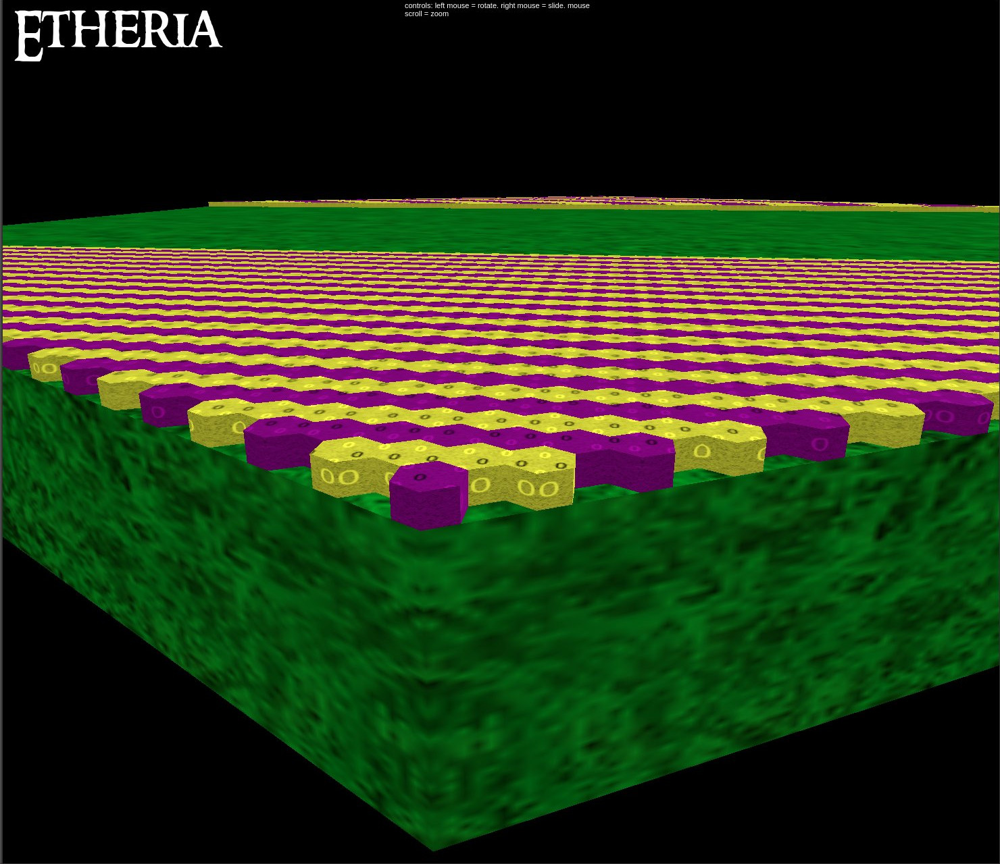
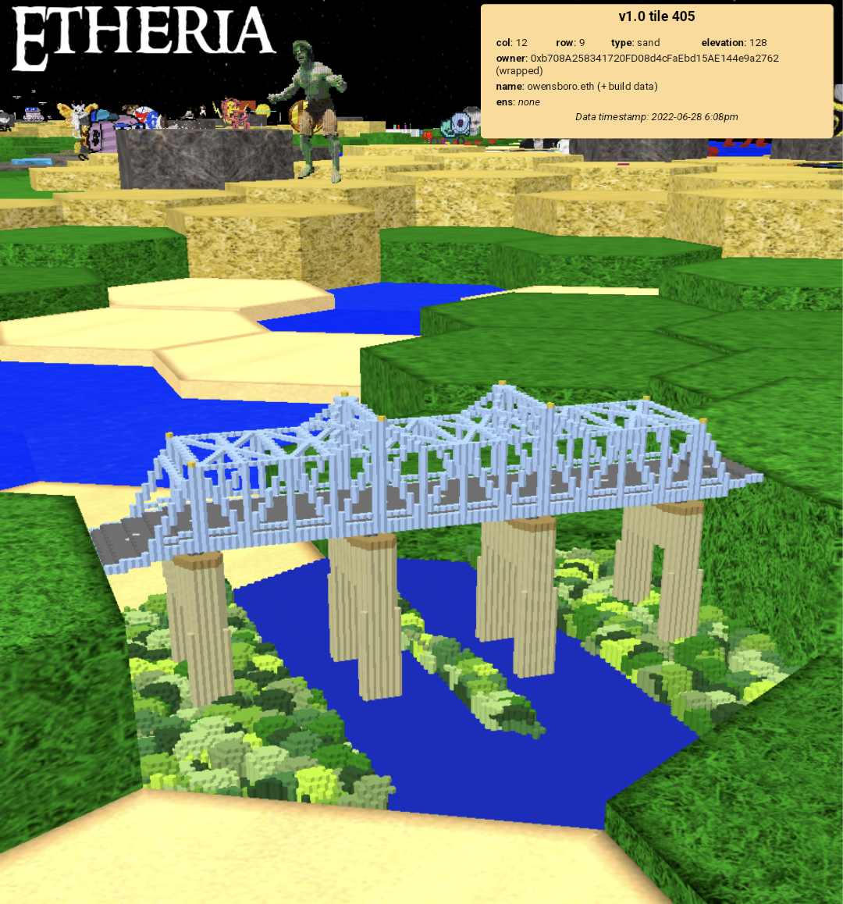

# etheria_hexStringToBuild

This is the small-but-somewhat-complicated bit of code that takes a compressed chunk of Etheria name+build data in hexadecimal form and returns renderable ThreeJS data as an array of "hexShapes" ("hex" as in "hexagonal").  

It is designed to be deployed as a NodeJS Lambda function on AWS, but could be easily modified for other purposes. The core algorithm is the same.

## Input

This lambda function expects triggering events of the form:
```
{
    "body-json": {},
    "params": {
        "path": {},
        "querystring": {
            "hexString": "15414c4c45474f5259204f4620544845204...",
        }
    }
}
```

## Output

Output is an array of ThreeJS hexShapes.
Note: These hex shapes are zero-located and only translated into their tile positions and elevations on the frontend based upon which tile the build data resides within.
(I had previously made the mistake of rendering all shapes *at* their tile locations and elevations which was suboptimal and had to be redone.)
Note: All the build data values are truncated to thousandths places to reduce build size (important for the DB and load on the wire).

```
[
  {
    "hexShape": {
      "shape": [
        {
          "x": -277.04,
          "y": -249.95
        },
        {
          "x": -277.04,
          "y": -249.85
        },
        {
          "x": -277.13,
          "y": -249.8
        },
        {
          "x": -277.21,
          "y": -249.85
        },
        {
          "x": -277.21,
          "y": -249.95
        },
        {
          "x": -277.13,
          "y": -250
        },
        {
          "x": -277.04,
          "y": -249.95
        }
      ],
      "holes": []
    },
    "extrudeSettings": {
      "depth": 0.1
    },
    "materialSettings": {
      "color": "#ffffff"
    },
    "lowestz": 0
  },
  {
    "hexShape": {
      "shape": [
        {
          "x": -276.78,
          "y": -249.8
        },
        {
          "x": -276.78,
          "y": -249.7
        },
   		...
   		]  
   	}
   	...
   }	
   ...
]   
```

## Configuration & requirements

Memory - 1769 MB
Ephemeral storage - 512MB
Timeout - 15 min 0 sec (the heaviest builds of 2021-2022 render in testing in ~1 min under these settings. 15 is likely huge overkill.)
Runtime - Node 14.x
Architecture - arm64

Libraries:
```
{
  "name": "three",
  "version": "0.139.2",
  "description": "JavaScript 3D library",
  ...
}

{
  "name": "pako",
  "description": "zlib port to javascript - fast, modularized, with browser support",
  "version": "2.0.4",
  ...
}
```

## Build data structure

Every Etheria tile is a hexagon made up of up to 128 layers in the z direction. Each layer has 9901 voxel locations. 



Each voxel location contains a single color code, either 4-bit or 8-bit, mapped to pre-determined palettes with value=0 always transparent. (Transparency is just a "color" like any other, as far as the build data is concerned.)

In raw, unrearranged, uncompresed form, the "buildArray" cells are in what I call "Tall south-north" form. That is, the voxel at index 0 is the closest purple voxel in the image above, the voxel at index 1 would be the voxel on top of it (in the z direction) and so-on in the same column until you reach max height (which is variable).

After reaching max height (i.e. "going tall") the next voxel would be the closest, leftmost yellow voxel shown in the image. The one after that would be a voxel stacked on top of it, and so on. So, for a build of height 16, the closest, leftmost yellow voxel would be at index 16. The hypothetical voxel at index 17 (not shown) would be just above (in the z direction). 

So how do we know the height?



Each name+build data hexadecimal chunk of data will tell you several bits of information as metadata. This is the beginning of the hexadecimal name+build data for the Cary Bridge build from June 2022.

```
0d6f77656e73626f726f2e6574680752789c...
^^ --- Length of the ASCII-only "name" part of the field: 13 chars or 26 hex values
  ^^^^^^^^^^^^^^^^^^^^^^^^^^ --- ascii code for 'owensboro.eth'
                            ^^ --- palette byte (in this case, 0x07 = 7 = 4-bit "Earth Tones" palette)
                              ^^ --- "leadingByte1" i.e. height and "algo" byte = 0x52
                                ^^^^→ The remainder is pako-deflated raw build data 
```

The height byte is decoded into an actual height value like so:

```
var detectedHeightCode = Math.floor(leadingByte1 / 16);
var detectedHeight = 0;
if (detectedHeightCode === 0)
	detectedHeight = 2; // special case to enable cheap, flat builds (height = 0 does us no good)
else
	detectedHeight = detectedHeightCode * 16; // 1=16,2=32, up to 128
```
In the case of the bridge build:
0x52 = 82
82 / 16 = 5 (duh)
5 * 16 = height 80

The "algo" (how the data is rearranged before compression) is determined in this manner:
```
var detectedAlgoCode = leadingByte1 % 16;
```
where 
0 = TallSN
1 = FlatSprial (inside-out)
2 = TallNS
3 = FlatSpiral (outside-in)

The compression algorithm tries each of these data rearrangements before pako to see which one produces the smallest result. The stored algo code lets would-be decompressors know how to rearrange into the standard form after pako-inflation.

In the case of the bride build, 0x52 % 16 = 2 = TallNS

## The rendering algorithm

This is too complicated to explain here, but also semi-self-explanatory from the code. 
In short, we start from the bottom layer and look for voxels of the same color and then upwards for more voxels of the same color. These extrudable chunks of color become the "hexShapes" that get returned from this lambda/function.
We also have to look for "holes" within these chunks and extrude those as well, sometimes in another color and sometimes actually-empty holes.

Hopefully this has been enough information to be able to decompress Etheria builds!!


                              


